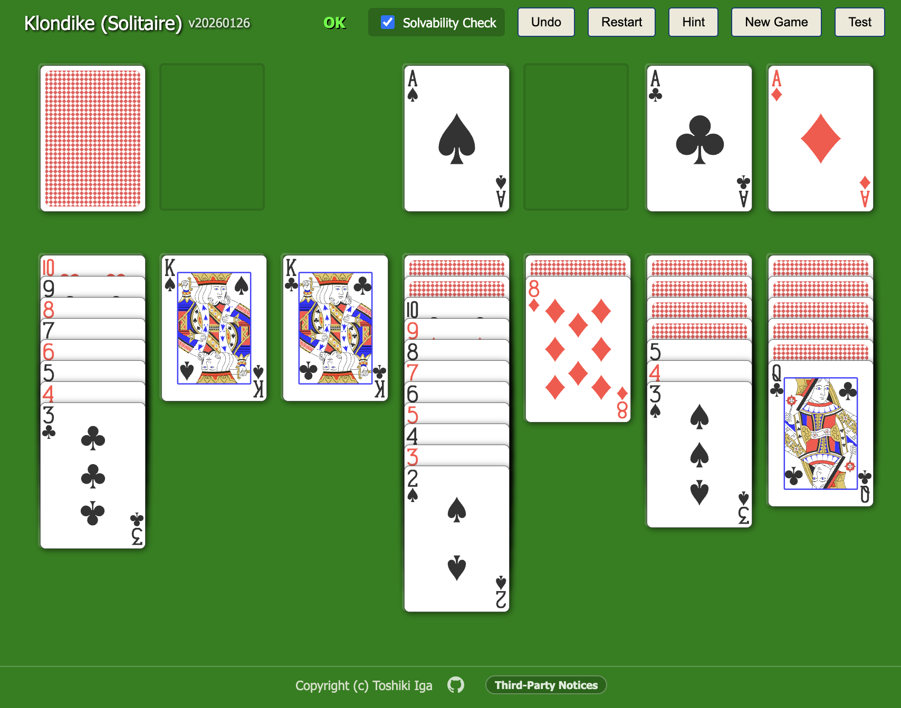

# Klondike (Static Web App)

Play Klondike (Solitaire) in the browser — a single-file, easy-to-share web app with smooth, tactile controls and friendly recovery tools.

## Highlights
- Single-file static web app that is easy to share, archive, and run anywhere.
- Fast, tactile controls (click / long press / right click) tuned for smooth play.
- Friendly recovery tools: Undo/Restart, Hint, and delayed auto-move with safety checks.
- New Game avoids overly stuck starts for better flow.
- Multiple builds (animated / non-animated / self-contained) for different use cases.
- Solvability warnings help you understand when the game is stuck.

## Directory
- `index.html`: self-contained distribution (libraries bundled)
- `index-online.html`: animated version (Motion One / Test button)
- `index-noanime.html`: non-animated version
- `GameLogic.md`: game logic specification
- `AGENTS.md`: development agreements and policies
- `THIRD_PARTY_NOTICES.md`: third-party license texts
- `ARCHITECTURE.md`: behavior notes and execution model

## Third-Party
- This project bundles and/or uses third-party products.
- See `THIRD_PARTY_NOTICES.md` for license texts and attributions.

---

# クロンダイク（静的 Web アプリ）

ブラウザで遊べるクロンダイク（ソリティア）。単一 HTML で完結し、触って気持ち良い操作性とリカバリ手段が揃った静的 Web アプリ。

## 魅力ポイント
- 単一 HTML の静的 Web アプリで、配布・保存・起動がとても簡単。
- クリック/長押し/右クリックの操作が速く、触っていて気持ち良い。
- Undo/Restart、Hint、遅延付きオート移動など詰まり時のケアが充実。
- New Game は詰まりにくい初期配置を作り、テンポが良い。
- アニメ版/非アニメ版/自己完結版の3種類を用途で選べる。
- 詰み警告で状況が分かりやすい。

## ディレクトリ
- `index.html`: 自己完結版（ライブラリ同梱で単一HTMLファイルで動作）
- `index-online.html`: ネットワーク必要版（ライブラリはCDNから都度読み込み）
- `index-noanime.html`: アニメーションなし版（カード移動などが非表示）
- `GameLogic.md`: ゲームロジック仕様
- `AGENTS.md`: 開発時の合意事項・方針
- `THIRD_PARTY_NOTICES.md`: OSS ライセンス本文
- `ARCHITECTURE.md`: 挙動メモと実行モデル

## サードパーティ
- 本プロジェクトはサードパーティ製品を同梱または利用しています。
- ライセンス本文とクレジットは `THIRD_PARTY_NOTICES.md` を参照してください。
