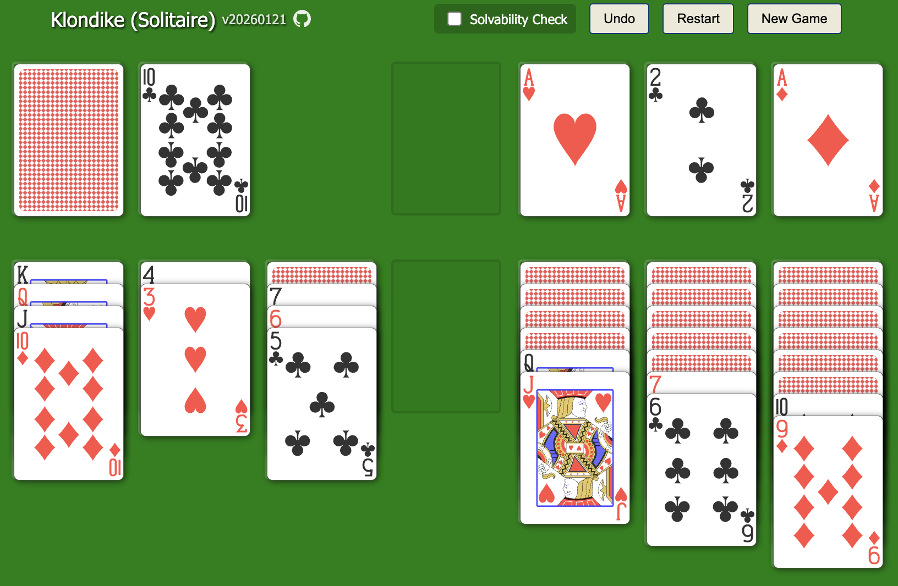

# Klondike (Static Web App)

Play Klondike (Solitaire) in the browser — a static web app contained in a single HTML file.
ブラウザで遊べるクロンダイク（ソリティア）。単一 HTML で完結する静的 Web アプリ。

Current Version: v20260122

## 目的
- 1ファイル（単一 HTML）完結の静的 Web アプリとして公開できる形にする。
- ルールは `GameLogic.md` に準拠する。

## 仕様メモ
- ドローは 1 枚固定（Draw 1）。
- クリック操作が中心（左クリックで場札移動、ダブルクリックは組札移動のみ。右クリックは山札の移動操作のみ）。
- オート移動は遅延付き（安全判定あり）。
- 勝利時はオーバーレイで表示する。
- Undo/Restart を実装済み（Ctrl/Cmd+Z、ボタンあり）。
- New Game ボタンで詰まりにくい初期配置を生成する。
- `index-animated.html` には Test ボタンがあり、連鎖アニメ用のテストデッキを生成する。
- 「Solvability Check」トグルで詰まり判定を行い、警告を表示する。
- ヘッダーにバージョン表記と GitHub リンクを表示する。
- 採用ライブラリ: CardMeister（Unlicense）。
- デバッグログは当面残す。

## ディレクトリ
- `GameLogic.md`: ゲームロジック仕様
- `AGENTS.md`: 開発時の合意事項・方針

## 次に決めたいこと
- リサイクル条件、詰み判定の厳密さ
